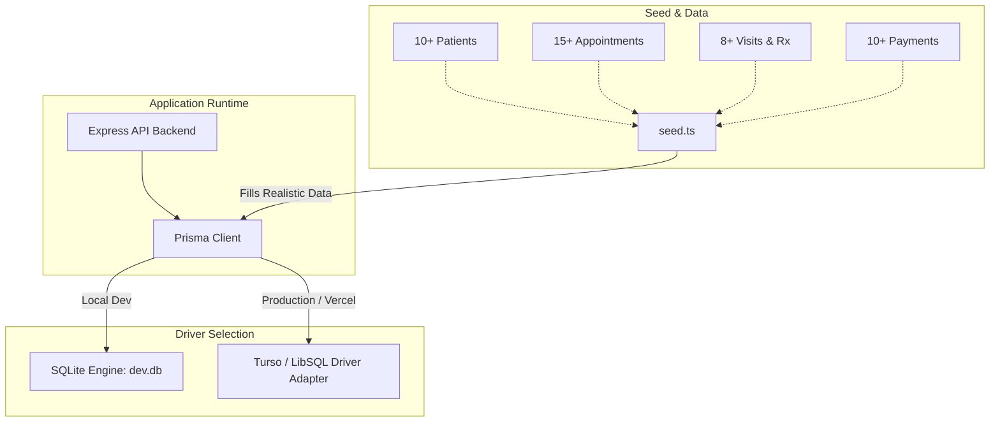

# SQLite Refactor and Fake Data Implementation Plan

> **For agentic workers:** REQUIRED SUB-SKILL: Use superpowers:subagent-driven-development to implement this plan task-by-task. Steps use checkbox (`- [ ]`) syntax for tracking.

**Goal:** Refactor the database layer from PostgreSQL to SQLite (`file:./dev.db`), add Turso/LibSQL adapter support for seamless Vercel serverless deployment, and generate rich, realistic clinical fake data.

**Architecture:** Upgrade Prisma to 6.x to leverage native SQLite support for Enums, Json, and Decimals. Configure the Prisma client to dynamically load the `@prisma/adapter-libsql` driver adapter if Turso credentials are present, falling back to local SQLite otherwise. Replace old Postgres migrations with SQLite schema, and implement a robust clinical data seeder in `backend/prisma/seed.ts`.

**Architecture Diagram:**

**Tech Stack:** Node.js, TypeScript, Express, Prisma 6.x, `@prisma/adapter-libsql`, `@libsql/client`, SQLite 3, bcryptjs.  
**Spec:** [SQLite Refactor Spec](../../../docs/superpowers/specs/2026-09-08-sqlite-refactor-and-seed-data-design.md)

## Global Constraints
- Do not break existing API response schemas (money amounts must remain formatted 2-decimal strings like `"150.00"`).
- Preserve existing roles (`DOCTOR`, `SECRETARY`) and permissions without regressions.
- Keep local development 100% operational with zero docker container requirements for the database.
- Maintain compatibility with Vercel serverless deployment via LibSQL adapter.

---

### Task 1: Package Dependencies & Prisma 6 Upgrade

**Files:**
- Modify: `backend/package.json`

- [ ] **Step 1: Update dependencies in `backend/package.json`**
  Upgrade `prisma` and `@prisma/client` to `^6.4.1`, and add `@prisma/adapter-libsql` (`^6.4.1`) and `@libsql/client` (`^0.14.0`).
- [ ] **Step 2: Run `pnpm install` in `backend`**
  Execute `pnpm install` inside `backend/` and verify package resolution.
- [ ] **Step 3: Commit package updates**
  `git commit -m "build(backend): upgrade to prisma 6 and add libsql adapters"`

---

### Task 2: Schema Refactoring for SQLite

**Files:**
- Modify: `backend/prisma/schema.prisma`

- [ ] **Step 1: Update `backend/prisma/schema.prisma`**
  - Change provider in `datasource db` to `"sqlite"`.
  - Add `previewFeatures = ["driverAdapters"]` in `generator client`.
  - Remove `@db.Decimal(12, 2)` annotations from `Payment.totalAmount`, `Payment.paidAmount`, `Payment.remainingAmount`, `PaymentRevision.totalAmount`, `PaymentRevision.paidAmount`, `PaymentRevision.remainingAmount`.
- [ ] **Step 2: Remove PostgreSQL-only migration folder**
  Remove `backend/prisma/migrations` to allow clean SQLite migration generation.
- [ ] **Step 3: Run `pnpm prisma generate`**
  Generate Prisma Client for SQLite.
- [ ] **Step 4: Commit schema changes**
  `git commit -m "refactor(db): update schema.prisma for sqlite provider"`

---

### Task 3: Environment & Dynamic Prisma Client Initialization

**Files:**
- Modify: `backend/src/config/env.ts`
- Modify: `backend/src/lib/prisma.ts`
- Modify: `backend/.env.example`

- [ ] **Step 1: Update `backend/src/config/env.ts`**
  Relax `DATABASE_URL` validation from `z.string().url()` to `z.string().min(1).default("file:./dev.db")`.
  Add optional `TURSO_DATABASE_URL: z.string().optional()` and `TURSO_AUTH_TOKEN: z.string().optional()`.
- [ ] **Step 2: Update `backend/src/lib/prisma.ts`**
  Support dynamic initialization: If `TURSO_DATABASE_URL` (or `DATABASE_URL` with `libsql://`) is present, instantiate `PrismaLibSql` with `createClient`. Otherwise, instantiate standard `new PrismaClient()`.
- [ ] **Step 3: Update `backend/.env.example`**
  Add example SQLite `DATABASE_URL=file:./dev.db` and Turso instructions.
- [ ] **Step 4: Commit client and config changes**
  `git commit -m "feat(db): support dynamic local sqlite and turso libsql adapter"`

---

### Task 4: Database Push / Migration & SQLite File Initialization

**Files:**
- Create: `backend/prisma/dev.db` (generated by prisma)

- [ ] **Step 1: Run `pnpm prisma db push`**
  Create local SQLite database tables matching the refactored schema.
- [ ] **Step 2: Verify SQLite tables created**
  Verify tables `User`, `Clinic`, `Patient`, `Appointment`, `Visit`, `VisitRevision`, `Prescription`, `PrescriptionRevision`, `Payment`, `PaymentRevision` exist.
- [ ] **Step 3: Update `.gitignore`**
  Ensure `backend/prisma/*.db`, `backend/prisma/*.db-journal` are ignored in `.gitignore`.
- [ ] **Step 4: Commit migration setup**
  `git commit -m "chore(db): initialize sqlite database schema and ignore db binaries"`

---

### Task 5: Rich Clinical Fake Data Generator

**Files:**
- Modify: `backend/prisma/seed.ts`

- [ ] **Step 1: Write comprehensive seeding logic in `backend/prisma/seed.ts`**
  - Seed default Doctor (`doctor@example.com` / `ChangeMe123!`).
  - Seed default Secretary (`secretary@example.com` / `ChangeMe123!`).
  - Seed Clinic: "عيادة الأمل التخصصية" (Al-Amal Clinic).
  - Seed 10+ Patients with realistic Arabic/English names, phones, medical histories.
  - Seed 15+ Appointments across `SCHEDULED`, `COMPLETED`, `CANCELLED`, `NO_SHOW`.
  - Seed 8+ Visits with detailed clinical diagnoses (Hypertension, Type 2 Diabetes, Gastroenteritis, Acute Sinusitis, etc.) and audit revisions.
  - Seed 6+ Prescriptions with realistic structured medication JSON (`dosage`, `frequency`, `duration`).
  - Seed 10+ Payments across `CASH`, `CARD`, `BANK_TRANSFER` with accurate total/paid/remaining amounts and audit revisions.
- [ ] **Step 2: Execute `pnpm seed`**
  Run `pnpm seed` and confirm zero errors and successful seeding output log.
- [ ] **Step 3: Commit seed script**
  `git commit -m "feat(db): implement comprehensive clinical fake data seeder"`

---

### Task 6: Docker Compose & Documentation Update

**Files:**
- Modify: `docker-compose.yml`
- Modify: `RUN_PROJECT.md`
- Modify: `README.md`

- [ ] **Step 1: Update `docker-compose.yml`**
  Remove the `postgres` service and remove `depends_on: postgres` from `backend`. Mount `./backend/prisma:/app/prisma` in `backend` so local SQLite data persists.
- [ ] **Step 2: Update documentation**
  Update `RUN_PROJECT.md` and `README.md` to reflect SQLite local workflow and Turso for Vercel.
- [ ] **Step 3: Commit compose and doc updates**
  `git commit -m "docs: update run instructions and compose for sqlite workflow"`

---

### Task 7: Full Verification & Sanity Testing

**Files:**
- Test all endpoints and services.

- [ ] **Step 1: Typecheck**
  Run `pnpm typecheck` in `backend` and ensure 0 TypeScript errors.
- [ ] **Step 2: Linting**
  Run `pnpm lint` in `backend` and ensure clean lint report.
- [ ] **Step 3: Run backend test suite**
  Run `pnpm test` in `backend` and verify all tests pass.
- [ ] **Step 4: Verify Auth & Health API**
  Start backend server or invoke endpoints to verify login for Doctor & Secretary accounts and query patient/appointment/visit data.
